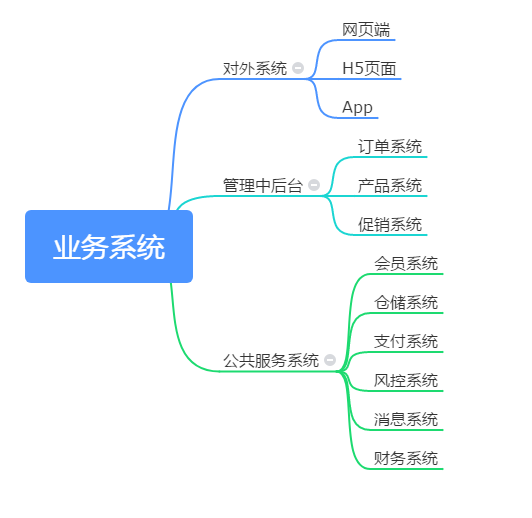
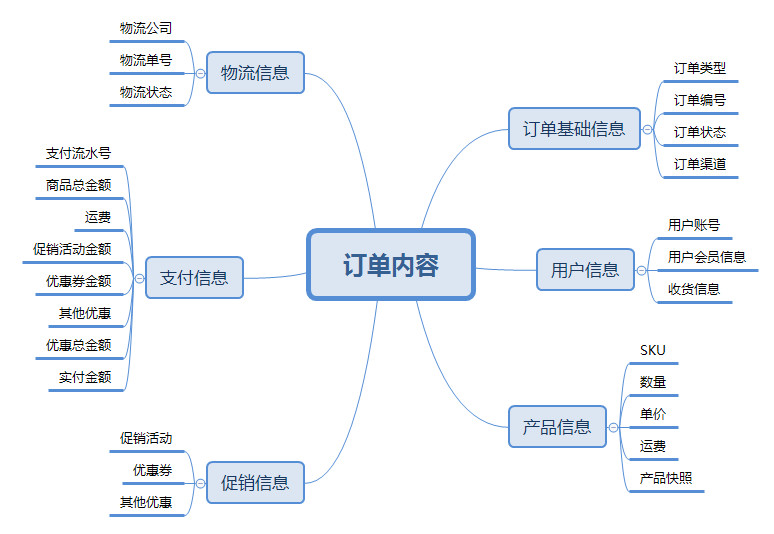
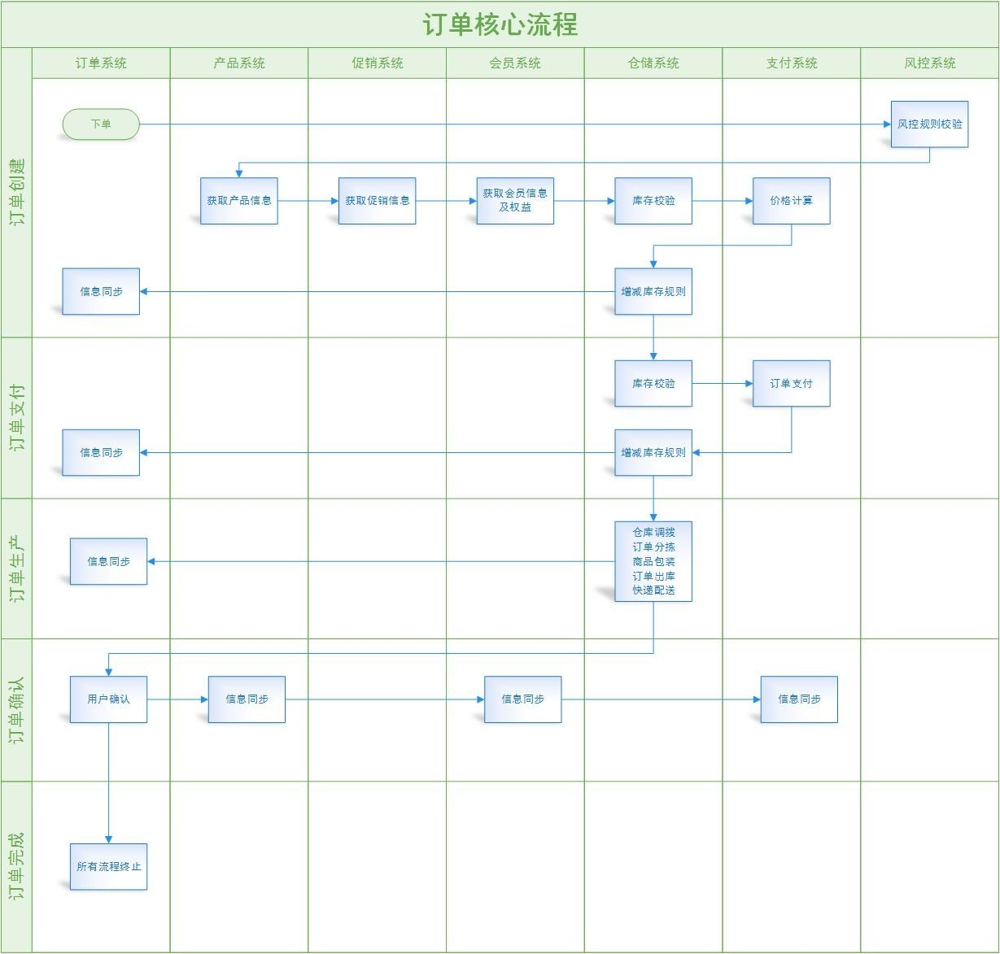
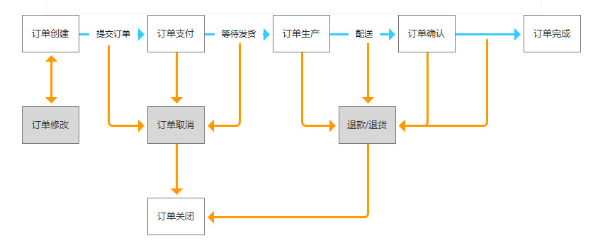
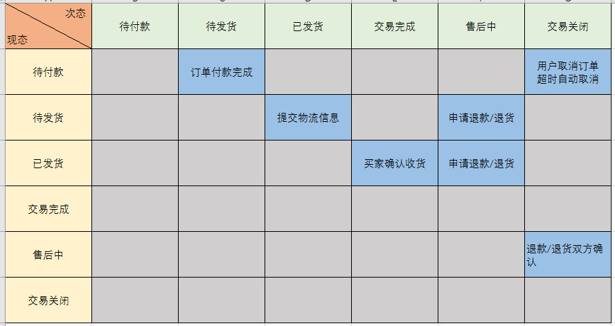

## 爱回收(后端)

> 环境及框架

###### laravel5.8.17+php7.3.1+Mysql5.7.24+Apache2.4.37

> 业务系统

#### 订单模块

1. 订单内容信息

2. 流程引擎

（1）正向流程

以一个通用B2C商城的订单系统为例，根据其实际业务场景，其订单流程可抽象为5大步骤：订单创建>订单支付>订单生产>订单确认>订单完成。

（2）逆向流程

逆向流程是各种修改订单、取消订单、退款、退货等操作，需要梳理清楚这些流程与正向流程的关系，才能理清订单系统完整的订单流程。

（3）状态机

状态机是管理订单状态逻辑的工具。状态机可归纳为3个要素，即现态、动作、次态。

现态：是指当前所处的状态。

动作：动作执行完毕后，可以迁移到新的状态，也可以仍旧保持原状态。

次态：动作满足后要迁往的新状态，“次态”是相对于“现态”而言的，“次态”一旦被激活，就转变成新的“现态”了。

> 数据库设计

#### 订单模块

###### 订单基础信息(Order_Basis_Information)

字段名 | 数据类型 | 不是NULL | 默认值 | 主键 | 注释
---|---|---|---|--- |---
order_id | INT | Yes | 0 | Yes | 订单基础信息主键
order_type | ENUM | Yes | 0 | No | 订单类型:[{1:旧机回收(recovery)},{2:以旧换新(renew),{3:维修(repair)}]
order_state | ENUM | Yes | 0 | No | 订单状态:[{1:待付款(obligation)},{2:待发货(delivery),{3:已发货(shipped)},{4:待付款(dealDone)},{5:售后中(afterSale),{6:交易关闭(dealClosure)}]
order_Channel | ENUM | Yes | 0 | No | 订单渠道:[{1:pc},{2:H5,{3:app}]
created_at | DATETIME | Yes | 9999-12-31 23:59:59 | No | 订单创建时间
updated_at | DATETIME | Yes | 9999-12-31 23:59:59 | No | 订单更新时间

###### 用户信息(User_Information)

字段名 | 数据类型 | 不是NULL | 默认值 | 主键 | 注释
---|---|---|---|--- |---
user_id | INT | Yes | 0 | Yes | 用户信息主键
member_id | INT | Yes | 0 | No | 用户会员信息外键
logistics_id | INT | Yes | 0 | No | 物流信息外键
created_at | DATETIME | Yes | 9999-12-31 23:59:59 | No | 订单创建时间
updated_at | DATETIME | Yes | 9999-12-31 23:59:59 | No | 订单更新时间

###### 产品信息(Product_Information)

字段名 | 数据类型 | 不是NULL | 默认值 | 主键 | 注释
---|---|---|---|--- |---
product_id | INT | Yes | 0 | Yes | 产品信息主键
sku_memory_capacity | ENUM | Yes | 0 | No | SKU内存容量:[{1:2G},{2:3G},{3:4G},{4:6G},{5:8G}]
sku_storage_space | ENUM | Yes | 0 | No | SKU存储空间:[{1:16G},{2:32G},{3:64G},{4:128G},{5:256G}，{6:512G}]
sku_color | VARCHAR | Yes | 0 | No | SKU颜色 
sku_network_type | ENUM | Yes | 0 | No | SKU网络类型:[{1:全网通},{2:联通},{3:移动},{4:电信}]
created_at | DATETIME | Yes | 9999-12-31 23:59:59 | No | 订单创建时间
updated_at | DATETIME | Yes | 9999-12-31 23:59:59 | No | 订单更新时间

###### 物流信息(Logistics_Information)

字段名 | 数据类型 | 不是NULL | 默认值 | 主键 | 注释
---|---|---|---|--- |---
logistics__id | INT | Yes | 0 | Yes | 物流信息主键
logistics_documetn_number | INT | Yes | 0 | No | 物流单号
logistics_company | VARCHAR | Yes | 0 | No | 物流公司
logistics_state | VARCHAR | Yes | 0 | No | 物流状态
created_at | DATETIME | Yes | 9999-12-31 23:59:59 | No | 订单创建时间
updated_at | DATETIME | Yes | 9999-12-31 23:59:59 | No | 订单更新时间

###### 支付信息(Payment_Information)

字段名 | 数据类型 | 不是NULL | 默认值 | 主键 | 注释
---|---|---|---|--- |---
payment__id | INT | Yes | 0 | Yes | 支付信息主键
goods_total | INT | Yes | 0 | No | 商品总金额
freight | INT | Yes | 0 | No | 运费
promotion_money  | INT | Yes | 0 | No | 促销活动金额
coupon_money  | INT | Yes | 0 | No | 优惠券金额
other_coupon | INT | Yes | 0 | No | 其他优惠金额
coupon_total | INT | Yes | 0 | No | 优惠总金额
payment_amount | INT | Yes | 0 | No | 优惠总金额
created_at | DATETIME | Yes | 9999-12-31 23:59:59 | No | 订单创建时间
updated_at | DATETIME | Yes | 9999-12-31 23:59:59 | No | 订单更新时间

###### 促销信息(Promotion_Information)

字段名 | 数据类型 | 不是NULL | 默认值 | 主键 | 注释
---|---|---|---|--- |---
promotion__id | INT | Yes | 0 | Yes | 促销信息主键
promotion_type | ENUM | Yes | 0 | No | 促销类型:[{1:活动(active)},{2:优惠券(coupon),{3:其他优惠(other_coupon)}]
promotion_content | VARCHAR | No |  | No | 促销信息内容
money | INT | Yes | 0 | No | 促销金额主键
created_at | DATETIME | Yes | 9999-12-31 23:59:59 | No | 订单创建时间
updated_at | DATETIME | Yes | 9999-12-31 23:59:59 | No | 订单更新时间

> Api接口

